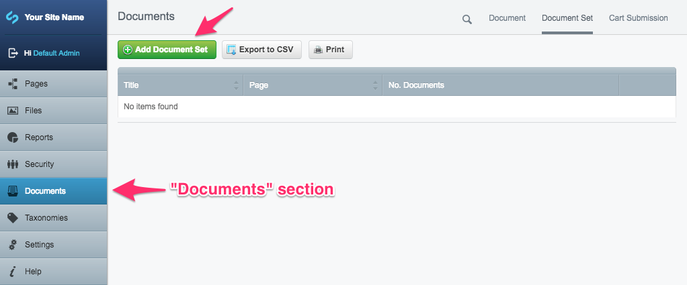
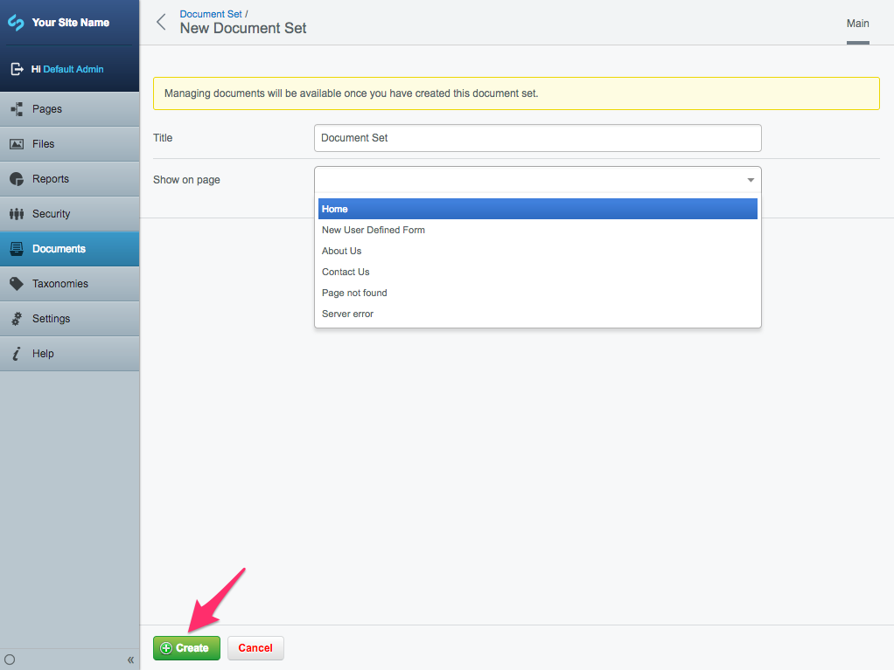
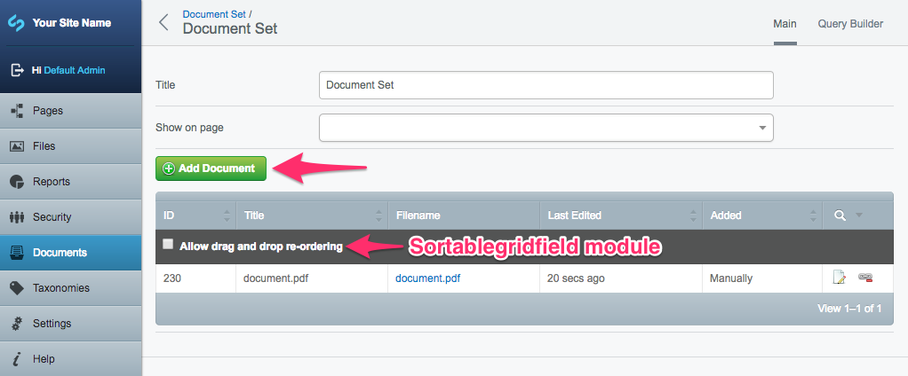
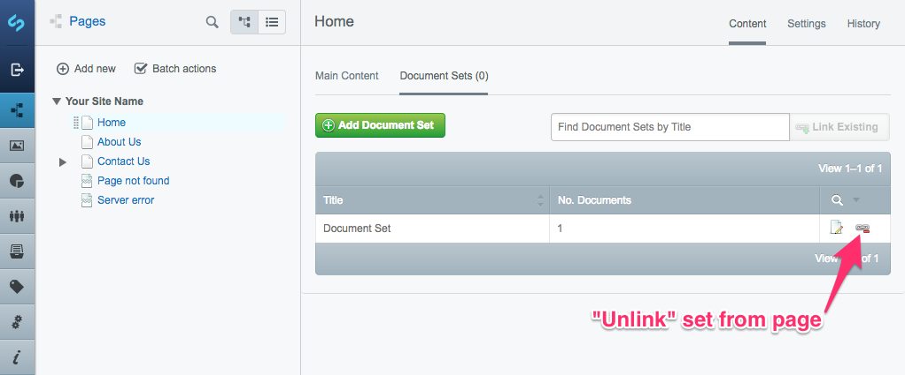
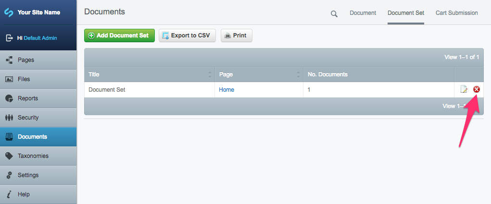
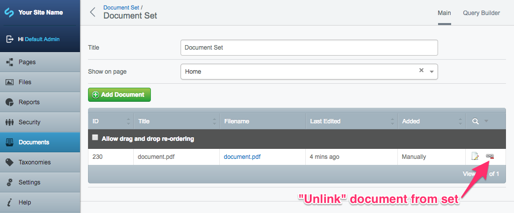
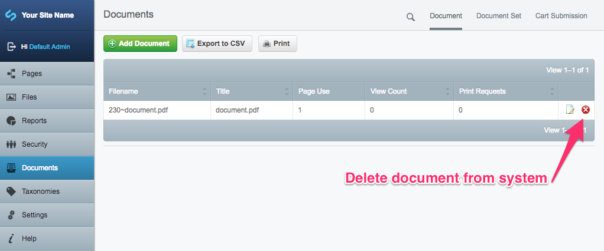

# Document set management

## Creating a Document Set

You can create Document Sets directly on a **Page** or in the **Documents** section.

In the **Documents** section, go to the new tab "Document Set", then use the button "Add Document Set" to create a new document set.

If you want to create a Document Set directly from a page, navigate to the page, select the "Document Set" tab and the same "Add Document Set" button will appear.

Clicking the "Add Document Set" button will prompt you to fill in two fields: "Title" and "Show on page".

The "Title" is the name of the document set that is used for display and searching purposes. The "Show on page" dropdown will let you immediately assign this document set to a page.

If you don't want to assign a document set to a page right now, you can leave it blank – although the title for your new document set is compulsory. Once you’ve given it a name, click "Create".

## Adding documents to a Document Set

As soon as you create a Document Set you can add documents to it, regardless of where it was created from. You can do this by clicking "Add Document".

The "Add Documents" page allows you to upload a file directly from your computer; either select "Choose files to upload" if you want to find the files in your file system using a navigation tool; or just drag-and-drop the files into the "Drop Area".

Alternatively, you can add documents to your new Document Set that already exist in the CMS. To do this, just select the "From the CMS" tab and search for the filename or browse by the page that document is on.

_**Note:** All of your documents will be uploaded into the "Documents" section's "Document" tab. Uploading documents in the "Documents" section works the same way as uploading files in the "Files" section. The only difference is that DMS documents are invisible to parts of SilverStripe CMS that handle files, meaning that they cannot be selected via the "Insert File" button when editing HTML content on a page, for example. They also have a higher level of security permissions and flexibility. You can read more about_ [working with images and documents](https://userhelp.silverstripe.org/en/creating_pages_and_content/creating_and_editing_content/working_with_images_and_documents/).

After uploading your documents click "Done!". You will then be taken back to that document set. You will see your documents in a list with their ID and filename, along with other information such as when the document was last edited and how the documents were added to the document set.

**Tip:** If you have the [sortablegridfield module](http://addons.silverstripe.org/add-ons/undefinedoffset/sortablegridfield) installed, you can reorder the documents in the list by drag-and-dropping them.

## Assigning a document set to a page

Head to the **Pages** section, click "Home" and go to the "Document Sets" tab. You can "Link existing" by using the _"Find Document Sets by Title"_ search bar to add an existing document set. To link existing document sets, start typing into the "link existing" search box and an autocompleted list of document sets that are not already assigned to a page will be displayed. Select the set you want from the results and click "Link Existing" to link it to the current page.

You can add and edit document sets while in the "Document Sets" tab attached to a page, or from the **Documents** section in the CMS. Both methods work the same way.

## Unlinking a document set from a page

If you want to remove a Document Set from a page, go to "Document Sets" tab and then use the "Unlink" button. This won't delete the Document Set, but will stop displaying that set on that page.

## Deleting a Document Set

To delete a Document Set, you must navigate to the **Documents** section. Click the "Document Set" tab and click on the delete icon on the right hand side of the set you want to delete. This will bring up a dialog box confirming if you want to delete the set. Click "OK" to delete the document set or "Cancel" to return to the Document Set page.

_**Note:** If you delete a Document Set, the documents will still remain on the system._

## Removing a file from a Document Set

To remove a file from a Document Set, navigate to the Document Set tab (either in **Documents** or from the **Page**) and open the Document Set. All documents in that set will be displayed along with an "Unlink" button. This will not delete the document, but will remove it from the Document Set.

## Deleting files from the CMS

To delete documents entirely from the system go to the **Documents** section, "Document" tab, and click on the delete icon on the right hand side of the document you want to delete. Similarly to deleting a Document Set, you will be asked to confirm if you want to delete the document.

